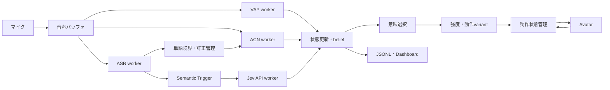

# nod 詳細設計 v1

更新日: 2026-09-18。実装対象: `C:\Users\kosuk\nod`。

本書は前回の実装計画を具体化する設計決定書。Jevのアクセスはユーザーが取得済み。APIキー設定・実際の接続確認は別の起動時チェックであり、アクセス取得待ちを設計の阻害要因にしない。本ターンではAPIへの音声・文字列送信、学習、モデル推論は実施していない。

同梱する `runtime.v1.json` は未調整の初期設定、`jev-request.example.json` は合成発話を入れた要求例、`contracts.schema.json` は境界データ型、`acceptance-scenarios.json` は実装時の受入条件。数値は測定結果や性能保証ではない。

## 1. 今回決めること

1. ローカルの非同期制御を中心とし、外部への推論要求はJevのみ。
2. 意味カテゴリの推定、動作可否の判断、強度の決定を別々の関数にする。
3. Jevは1要求実行中＋最新1要求保留。音声処理はJev完了を待たない。
4. ASRの追記と訂正を別に扱い、単なる追記で全要求が破棄され続ける状態を避ける。
5. 同じ発話への複数Jev観測は置換する。独立観測と仮定して繰り返し乗算しない。
6. beliefの時間遷移を連続時間で定義する。tickの回数で結果が変わらない形にする。
7. opportunityを一つの期間として管理し、一期間から動作を連打しない。
8. ACNの単語境界待ちと先読み待ちは処理時間と分けて計測する。
9. 動作命令にIDと期限を付け、再接続時に古い動作を再送しない。
10. モデル資産が欠けていても開発できるが、代替動作は画面とログで明示する。

## 2. 実行構成と所有権



- Core process: event bus、reducer、clock、Jev client、policy、scheduler、WebSocket、記録。
- Audio capture: コールバックではコピー／連番付け／バッファへの投入だけ。推論・ファイル書き込み・ネットワーク待機を行わない。
- VAP/ASR: 各1つの持続worker。Windowsではspawn方式を前提とし、モデルはworker初期化時に一度だけロード。
- ACN: 持続workerで特徴抽出とNumPy推論を行う。推論だけ軽くても抽出をイベントループ内に置かない。
- GPUを使う場合、ASRとVAPの同時実行を計測して割り当てる。最初はACNをCPU固定。
- mutableな`RuntimeState`の唯一の所有者はreducer。他workerにはimmutableな入力snapshotを渡す。
- Dashboardは推論を起動せず、状態を最大10 Hzで購読する。

公開Protocolは`OpportunityPredictor`、`StreamingASR`、`SemanticBackend`、`ProminencePredictor`、`DecisionPolicy`、`AvatarController`。モデル固有SDKや特徴計算をpolicyへ持ち込まない。

## 3. 時刻とイベント

### 3.1 2種類の時刻

- Audio time: 16 kHzのcanonical stream上の整数sample index。区間は半開区間 `[start_sample, end_sample)`。
- Control time: 同一セッションの`monotonic_ns`。deadline、cooldown、キュー滞留、HTTP待ちに用いる。
- capture時にsample indexとmonotonic clockの対応を保存し、欠落・再開ごとに対応区間を区切る。壁時計は表示用のみ。
- 元デバイスが48 kHz等の場合、resampling前後の対応と遅延を保存する。canonical 16 kHzはVAP/ASR用。ACNが別sample rateを要求する場合はmanifestに従った分岐を作り、同じ原音時刻へ対応付ける。
- 別プロセスのイベントはreducer受領時に`ingest_seq`を振る。replayはこの順番とcontrol timeを再現する。

### 3.2 必須イベント群

| イベント | 発行元 | 主な用途 |
|---|---|---|
| AudioFrame / AudioGap | capture | 入力区間・欠落の記録 |
| VAD / UtteranceOpened / UtteranceClosed | audio/ASR adapter | 発話のまとまりの管理 |
| ASRSnapshot / WordBoundaryUpdate | ASR | partial、追記／訂正、単語区間 |
| SemanticRequested / SemanticObservation / SemanticFailure | Jev worker | snapshot・結果・失敗の対応 |
| OpportunityUpdate | VAP | WHENのscore、モデル定義、期限 |
| ProminenceUpdate | ACN | 音声区間、raw score、強度score |
| BeliefUpdate / Decision | reducer/policy | 観測と判断の説明 |
| ActionCommand / ControllerEvent | output/controller | 準備・受領・開始・完了 |
| Tick / WorkerHealth / Shutdown | runtime | 時刻進行、障害、終了 |

JSON Schemaは外部境界と記録に重要な7レコードを定義する。内部の全イベントクラスを網羅するものではない。追加イベントは同じ識別・時刻規則で実装する。

Schema以外の検証: `end_sample >= start_sample`、時刻の順序、確率総和、sessionとrequestの参照整合、scoreの有限性、ACNが参照した音声の終端、command TTL。JSON読み込み時はNaN/Infinityを拒否する。

### 3.3 キューと過負荷

- 音声ring buffer: 初期30秒。workerごとにcursorを持ち、消費していない音声を見落とした場合は`AudioGap`として通知する。
- VAPは最新の必要contextを使って復帰できるが、結果をfresh扱いする前にwarmupを満たす。
- ASRは欠落区間を跨いだ継続仮説を破棄し、新segmentとして開始する。
- ACNは欠落を跨ぐ単語対を使用しない。
- 制御イベントqueueが満杯の場合、silent dropせず出力を停止してdegraded状態へ移る。新しい動作命令は生成しない。
- UI状態は最新1件へcoalesceできる。監査用イベントの欠落とは区別する。

## 4. ASRと発話識別

`ASRSnapshot`は`utterance_id`, `revision`, `repair_epoch`, `boundary_revision`を持つ。

- `revision`: 文面または境界が更新されるたびに増加。
- `repair_epoch`: 既存の文字列が削除・置換されたとき、または既にstableとした部分が取り消されたときに増加。
- `boundary_revision`: 時刻・分割だけの変化でも増加。語IDのsplit/mergeは旧IDを廃止し対応表を記録。
- `partial_text = stable_prefix + unstable_suffix`をadapterで保証する。
- stable prefixは連続2回の合意＋300 ms保持を初期案とする。最終確定ではなく、訂正可能な安定推定。
- 無音700 msを発話終了の初期候補とするが、ASR finalは同じutteranceへの更新。新たな音声開始で次utteranceへ移る。
- 700 ms未満の無音はphrase boundary triggerになっても、必ずしも発話を分割しない。
- 長い発話は最大30秒で直近の安定境界からsemantic epochを分割する。現在内容は新epoch、以前内容はrecent_contextへ移す。これは独立証拠を保証する分割ではなく、計算量とrollback範囲の制限。

日本語の単語境界は、まずASR adapterが返す時刻付き単位をバージョン付きで使用する。句読点に音声長を割り当てない。ASRが文単位の時刻しか返せない場合、文字数比例で単語時刻を捏造せず、ローカルalignment adapterを追加するかACNをdegradedにする。英語の学習時単位との違いは日本語評価で検証する。

## 5. Jev要求と意味の定義

利用する機能はChoice 1問。外部へ渡す内容は現在の文字起こしと短い過去文脈で、音声・VAP score・ACN score・現在belief・動作履歴は送らない。

現在の公式HTTP契約は`state + model + questions`を受け取り、`answers`内に全選択肢の確率を返す。非同期Python clientとretry無効化オプションも提供されている。[API](https://docs.typesafe.ai/api)、[Async client](https://docs.typesafe.ai/sdk/python/api/clients/async/client)

| フィールド | nodでの定義 |
|---|---|
| stable_transcript | 現在epochのstable prefix |
| current_partial | その続きのunstable suffixのみ。全文を二重に入れない |
| recent_context | 現在epochを除く直近20秒の完了済み発話。上限2000文字、古い発話から落とす |
| questions.listener_function | Choiceの4分類。実際のinstructionsは同梱JSONを正本とする |
| model | 検証対象のversion IDを固定。現在の候補はjev-1.13.0 |

`NO_BC`は「意味的にfeedbackが支持されない」であり、音響的な発火タイミングがないことと分ける。CONTINUERは継続促進、UNDERSTANDINGは理解・受領で賛成ではない。EMPATHICは喜び・困難の双方への具体的な受け止めで、感情の極性や表情は決めない。

要求のメタデータはnod側に保持する: request ID/seq、utterance/repair epoch、ASR revision、音声終端、ASR reliability、canonical input hash、prompt version。HTTP schemaに独自のtop-levelフィールドを足さない。

受信時は4キー完全一致、有限値、各値[0,1]、総和誤差1e-4以内を検証。総和はこの小誤差内だけ再正規化し、大きな不正値をclampして成功扱いにしない。raw分布と校正分布を両方保存する。`choice`をbeliefとして使用しない。provider confidenceは診断値として記録する。不正なresponseは`SemanticFailure(reason=invalid_schema)`へ記録し、有効分布を要求する`semantic_observation`を無理に生成しない。

合成入力例はAPI形式の確認用で、期待確率や実測結果ではない。日本語promptの変更は必ずquestion versionを変更する。

## 6. Jevのスケジューリング

### 6.1 Trigger

stable prefixの増加、既存仮説の訂正、語確定、phrase boundary、意味のある無音から候補を作る。初期は日本語品詞判定を必須にせず、安定文字列の増加と境界を用いる。入力が同じなら無音やtickごとに問い合わせない。

初期設定: debounce 120 ms、最初の保留から最大300 ms、dispatch間隔250 ms以上、inflight=1、pending=1。最大待ち時間は後続partialで延長し続けない。

状態: `IDLE → IN_FLIGHT → IDLE`。新候補はpendingを最新snapshotへ置き換える。HTTPが返るか800 msの全体deadlineで終わった後、最新pendingを必要なら送信する。SDK内の自動retryは無効にし、`asyncio`側でDNS・connect・responseを含む全体期限を管理する。

### 6.2 受信採否

次の順で判定し、一つのdispositionを記録する。

1. 不正なschema・別session → reject。
2. 同じrequest IDを既に処理済み → duplicate。
3. 既に別utteranceが開いている → previous_utterance。
4. repair epochが変化、または要求時文字列が訂正された → revised_input。
5. 既採用requestよりseqが古い → superseded。
6. 入力音声の終端から1500 ms超、またはHTTP全体deadline超 → expired。
7. それ以外 → accepted。

**追記だけなら古いrevisionの結果も採用できる。** ただし要求後に増えた音声の長さを`semantic_lag`として保持し、300 ms以上のlagがある場合はUNDERSTANDING/EMPATHICを候補から外す。NONE/CONTINUERのみで判断し、最新要求を保留する。否定・逆接・自己訂正候補を検出した場合も具体的反応を保留するが、その検出だけで意味分類を上書きしない。

新しい修正がactiveな観測の根拠を無効にした場合は、結果が来るまで以前の観測を使い続けず、次節のanchorからprediction-onlyへ戻す。ASR信頼度低下だけではbeliefを初期化しない。

### 6.3 障害

401/403: semantic workerを設定エラーとして停止。VAP/ASR/ACNは継続。429/529/5xx/通信失敗: 同じ古い要求は再送せず、1秒から最大30秒までbackoffし、期限内の最新snapshotだけを再評価する。Retry-Afterがある場合は少なくともその時間を尊重する。成功でbackoffを解除する。

失敗はNO_BCの観測を生成しない。既存beliefを時間遷移させ、freshな意味情報がなくなったら動作判断をNONEにする。未来に向けた自動再試行はruntimeの機能として行い、過去の発話への動作を遅れて発火させない。

## 7. belief: 連続時間と観測の置換

### 7.1 初期値と遷移

class order = `[no_bc, continuer, understanding, empathic]`。

初期beliefと定常分布の仮値を `pi = [0.60, 0.25, 0.10, 0.05]`、半減期を4秒とする。これらは学習結果ではない。

```text
alpha(dt) = 2 ** (-dt / 4 seconds)
T(dt) = alpha(dt) * I + (1 - alpha(dt)) * 1 * pi
predict(b, dt) = alpha(dt) * b + (1 - alpha(dt)) * pi
```

Tは4×4の行確率行列で、T(0)=I、T(a)T(b)=T(a+b)。従って50 ms tickでも100 ms tickでも、同じ経過時間なら同じpredictionになる。将来、データ由来のgeneratorまたは基準間隔Tへ交換できるProtocolにする。

### 7.2 ASR reliability

編集距離の値はログに残すが、追記を訂正と同じ罰則にしない。文字列安定度は共通音声区間の仮説を比較し、revision_qualityは直近5更新の訂正頻度から作る。

```text
q_asr = weighted_mean(confidence, stability, revision_quality)
weights = [0.30, 0.50, 0.20]
```

confidenceがないbackendでは残りの重みを再正規化する。単なる平均log probabilityをそのままconfidenceと呼ばず、adapterで明示的に変換するか欠損にする。測定できるreliability要素が一つもない場合はq=0とする。Jev confidenceを独立の観測として掛け足さない。

### 7.3 重複証拠を増やさない

各semantic epoch開始時に `(anchor_belief, anchor_control_time)` を保存する。active observationは常に最大1件。

新しいaccepted観測が時刻tで来た場合:

```text
prior = predict(anchor_belief, t - anchor_control_time)
p = semantic_calibration(raw_probabilities)
log_b = log(prior) + q_asr * log(max(p, 1e-6))
current_belief = softmax(log_b)
active_observation = new_observation
```

これは直前posteriorへの追加乗算ではなく、**同じanchorに対する最新観測への置換**である。その後のtickは採用時刻からpredictionのみ。q=0ならpriorと一致する。新epochを開く際に直前epochのcurrent beliefを次anchorへ引き継ぐ。

訂正でactive観測が無効になったらanchorから現在までprediction-onlyを再構成する。過去に送ったactionは取り消して再実行せず、まだPREPAREDの動作だけを取り消せる。

このV1は制御受領時刻で更新する近似filterで、厳密な遅延観測HMMではない。入力音声時刻は古さの検査に使う。文脈を跨ぐ観測相関も完全には消えないため、identity calibrationを未校正として表示し、Brier score等で過信を評価する。必要なら次段階でlikelihood ratio方式と比較する。

## 8. WHENと意思決定

### 8.1 opportunity期間

最新scoreが250 ms以内ならfresh。0.65以上が100 ms継続してOPEN、0.40以下が200 ms継続してCLOSEDへ戻る。OPENになった時点でopportunity IDを発行し、最大1回だけexecuteを許す。低下せず2秒経った期間は期限切れにして、低下・再上昇があるまで再発火しない。

OPEN前のhysteresis状態は`candidate_since`に保持する。少なくとも2つの異なるsource終端の更新が継続条件を満たすことを要求する。10 Hzの更新で確認するため、50 ms tickで同じ古いscoreを新しい観測として数えない。閾値は調整対象。

VAPのprediction horizonと、今動作を始めてよい時刻は別。V1は最新BC scoreに基づく即時発火の仮説として評価し、任意の未来onsetを推測して予約しない。onset推定がadapterで検証されるまでは`scheduled_onset_enabled=false`、Motor PreparationはIDLEのままとする。準備Protocol自体は後述の通り用意する。

### 8.2 意味選択はACNを参照しない

opportunity scoreをo、beliefをbとして、4状態の意思決定用質量を作る。

```text
m_no = (1 - o) + o * b_no
m_cont = o * b_cont
m_under = o * b_under
m_emp = o * b_emp
```

総和は1だが、oとbを結合したこの値が実世界の校正済みjoint probabilityだとは主張しない。

utility行列の初期案（列はno_bc / continuer / understanding / empathic）:

| 選ぶ意味機能 | NO_BC | CONTINUER | UNDERSTANDING | EMPATHIC |
|---|---:|---:|---:|---:|
| NONE | 0 | -0.20 | -0.40 | -0.60 |
| CONTINUER | -1.00 | 1.00 | 0.25 | -0.25 |
| UNDERSTANDING | -1.50 | 0.20 | 1.00 | -0.15 |
| EMPATHIC | -3.00 | -1.00 | -0.60 | 1.40 |

各行とmの内積を取り、NONEより0.10以上良い候補があれば最大のものを選ぶ。同率はNONE→CONTINUER→UNDERSTANDING→EMPATHICの順。誤った共感を強く罰する仮の効用であり、人の評価で調整する。

前提gate: opportunity OPEN/fresh、freshな意味観測、その観測のASR reliabilityが初期0.40以上、workerの入力継続、controller接続、未消費期間、motor IDLE（準備を有効にした将来版では有効なPREPAREDも可）。lagが大きい場合は前述の候補制限を加える。q=0の観測でbeliefを更新しても、freshな動作根拠が得られたとはしない。gate不成立ならNONE。NONEは毎tickアバターへ送らない。

## 9. ACNから動作強度へ

ACNは音響3cueのモデルを第一案とし、text surprisalをV1の強度経路へ入れない。採用構成と重みが未確定なので、manifestが揃うまでは`degraded_explicit`で既定強度を使う。

### 9.1 抽出・校正・古さ

単語区間が確定してから、manifest通りのfeatureを計算する。MFCCのcenter paddingが未来を参照する場合、その先読みも`lookahead_end_sample`へ含める。双方向ACNは次単語の終端まで待つ。語の途中を完成語として推論しない。

初期の[0,1]変換候補は、独立の校正用データで得たraw scoreの5/95 percentileを用いた単調な範囲変換:

```text
P = clip((raw_score - q05) / (q95 - q05), 0, 1)
```

これは「強度指標」であり、prominenceの確率ではない。q95-q05が小さすぎるartifactは無効。校正器がない状態で適当なsigmoidを適用して確率と呼ばない。校正artifactにはデータ・単語分割・正規化・モデル版を記録する。

新しいスコアでも対象語が古い場合があるため、freshnessは受信からでなく対象音声の終端から初期1000 msで判定する。未取得・古い・境界不確実・未校正ではP=0.25の仮値を使い、理由を明示する。ASR訂正された語のスコアは失効させる。

### 9.2 意味から動作への写像

```text
intensity = low[function] + (high[function] - low[function]) * P
```

| 意味 | intensity範囲 | 動作 |
|---|---|---|
| CONTINUER | 0.15–0.35 | SMALL_NOD |
| UNDERSTANDING | 0.25–0.70 | intensity < 0.60ならSMALL_NOD、それ以外STRONG_NOD |
| EMPATHIC | 0.35–0.75 | 中立的な共感表出に対応するcontrollerならEMPATHIC_EXPRESSION、なければSTRONG_NOD |

EMPATHICを笑顔・悲しい顔へ自動変換しない。controllerが`neutral_acknowledgement`を宣言していない場合、表情は選ばない。CLAPは仕様のenumには維持するが自動選択しない。

intensityは正規化された指令値で、物理角度や速度ではない。controller側で利用可能な動作範囲へ写像する。命令を送った後にACNが更新されても動作を重複送信しない。

## 10. Motorと通信

内部状態は`IDLE / PREPARED / SENT / ACTIVE / COOLDOWN / FAULT`。MotorPreparation enumはIDLE/PREPARE_NOD/PREPARE_STRONG_RESPONSEを別に保持する。

| 現在状態 | 入力 | 次状態・処理 |
|---|---|---|
| IDLE | 有効な未来onset推定＋準備対応 | PREPARED。prepareのみ送信 |
| PREPARED | 期限切れ、訂正、opportunity消失 | cancel_prepare後IDLE |
| IDLE/PREPARED | execute条件成立 | SENT。opportunityを消費 |
| SENT | accepted | SENTのまま開始を待つ |
| SENT | started | ACTIVE |
| ACTIVE | completed | COOLDOWN |
| COOLDOWN | 完了から900 ms経過 | IDLE |
| SENT/ACTIVE | timeout、切断、failed | FAULT。送信状態が不明なら盲目的にexecuteを再送しない |
| FAULT | 状態照会または再接続で停止確認 | COOLDOWNを経由して復帰 |

初期は`prepare`を無効にして即時executeだけで検証する。準備を実装した場合も実onsetの直前に最新状態を再検証し、prepareから自動的にexecuteへ進めない。

WebSocketはnodが127.0.0.1:8765で待ち受け、controllerが接続。helloでsupported actions、prepare/stop/status query対応、重複排除保持時間、clock ID、共感表情の性質を交換する。

命令は`session_id + connection_epoch + command_id`で重複排除。prepareとexecuteは別command IDで同じaction ID。executeのTTLは初期250 ms、onset_delayはV1で0。受領時からだけTTLを数えると輸送遅延を見落とすため、接続時に時計offsetと往復時間の推定を行い、送信時刻からの残り期限を使う。offset不確実性が残り期限より大きければrejectする。

ACKは300 ms、実行完了は2500 msを初期timeoutとする。acceptedは開始とは限らず、開始通知がないcontrollerでは実onset遅延はunknownと表示する。同一PC内でも異なる時計基準を直接引かない。startedがacceptedより先に届いてもACTIVEへ進み、遅れたacceptedでSENTへ戻さない。completedが先に届いた場合は完了を採用し、欠けたonsetをunknownとする。cancel/stop命令にも元の動作snapshotを添えるが、controllerはintensity等を新しい実行指示として解釈しない。

再接続時に古い送信queueは捨てる。controllerは直近actionのstatusを返し、重複排除の最低保持時間を60秒とする。status確認不能なら自動出力を止め、再同期を明示する。

## 11. 起動・停止・縮退

起動順: config検証 → model/artifact検証 → worker warmup → audio clock確立 → controller接続 → live出力許可。Jev clientは起動時に作成して接続を再利用する。入力デバイスやモデル変更は新sessionまたは明示的な再初期化にする。

| 失敗 | 動作 |
|---|---|
| Audio/VAP停止 | 新しい動作を停止。予約はcancel |
| ASR停止・Jev停止 | 音声系は継続。beliefはprediction。意味が期限切れになったらNONE |
| ACN資産なし・遅延 | 意味選択は継続、既定の控えめな強度。degraded理由を表示 |
| controller切断 | 再接続を試みるが動作はqueueしない |
| ログwriter異常 | 検証profileでは新規動作を止め、計測不能を表示 |

停止時は新規executeを止め、prepareをcancelし、対応していればstopを送る。workerを期限付きで終了し、ログをflushする。終了処理でAPI応答を無期限に待たない。

## 12. 記録・replay・画面

JSONLにはsession header、設定hash、モデル／prompt／calibration版、イベント、reducer採否、判断理由、action状態を残す。API認証ヘッダは保存しない。現在のSDKはdebug時にbodyを記録し得るため、通常はSDK debug loggingを無効にする。[SDK logging](https://docs.typesafe.ai/sdk/python/api/clients/async/client)

- 観測replay: 保存済みJev/VAP/ACNを再利用。ネットワーク不要、物理出力は既定でdry-run。
- 意味再評価: 保存ASR snapshotを新prompt/modelへ送る。別run IDとして記録し、元結果を上書きしない。
- 音声再評価: 音声保存が有効なセッションだけ。初期の`record_audio=false`ではこのモードを使えない。
- 決定論的replay: ingest seqと仮想control timeを使い、liveのsleepやAPI応答順序へ依存しない。

画面はWHEN、WHAT、HOW STRONGを別パネルにし、各値の対象音声時刻・古さ・有効性を表示する。特にraw Jev distributionとbelief、ACN rawとintensityを分ける。最新decisionには「ASR訂正で保留」「ACNなし・既定強度」「opportunity消費済み」等の理由を一つ以上表示する。

## 13. 検証と作業単位

| 作業 | 成果物 | 受入条件 |
|---|---|---|
| D1: coreとclock | イベント型、schema検証、仮想時計、logger | 同じイベントで同じ順序・判断 |
| D2: 意味経路 | Jev adapter、snapshot、trigger、期限・採否 | 訂正／追記／timeoutケースが定義通り |
| D3: belief/policy | 連続時間遷移、置換観測、utility | tick分割不変、q=0、重複観測不変、強度独立 |
| D4: motor/controller simulator | WebSocket、ID、ACK、状態機械 | 二重実行なし、古い再送なし、完了後に再実行可能 |
| D5: 音声/ASR/VAP | ローカルworker、欠落・word boundary | 日本語partialと時刻が得られ、lagを測れる |
| D6: ACN | manifest、export/load、特徴、score校正 | 元推論一致、対象区間・先読み・期限を追える |
| D7: 実機統合 | dashboard、負荷測定、調整記録 | 30分動作と障害注入、再生比較 |

D1〜D4はACN資産とGPU情報がなくても実装可能。D2の実API確認は利用権限取得済みのJevを使うが、本設計作業では呼んでいない。

初回の意味評価は日本語60発話、その後120発話以上へ拡張。各発話を途中・訂正・完成のsnapshotへ分ける。分割は発話単位で行い、同じ発話のsnapshotが校正用と最終評価用を跨がない。4分類は人の判断が曖昧になり得るため、ラベル分布または複数許容ラベルも記録する。Brier/log loss、macro F1、EMPATHIC誤判定、partialからの変化、HTTP往復遅延を評価する。

60/120は初期評価量の目安であり、統計的十分性の保証ではない。stage別p50/p95/p99、取得から利用可能になる遅延、音声欠落、actionの適切さを測る。decision→command p95=50 msを暫定目標とし、ASR/Jev/単語待ちを含む全体遅延と混同しない。

## 14. 残る入力と進行への影響

- ACNの採用checkpoint、scaler、特徴抽出設定: D6に必要。D1〜D5は先行できる。
- PCのGPU/VRAM/RAM: D5のbackendサイズと同時実行配分に必要。設計の基本構造は変更不要。
- 実アバターの通信・動作定義: D7に必要。D4ではsimulatorを使う。
- Jevアクセス: 取得済み。環境変数設定と接続確認はD2の作業に含む。

この設計でモデル学習や追加の心理stateは必須にしない。ACNの過去のみ版への再学習は、双方向版の遅延評価で必要になった場合に別途計画する。
