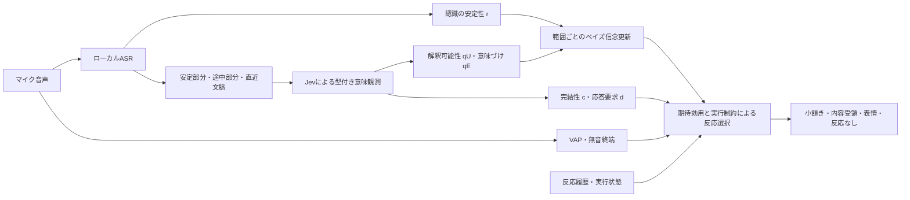

**型付き意味観測を用いた逐次ベイズ聞き手モデル — nod 0.9.1 / listener_responsive_v4 / local-receipt-1**

本モデルは、音声から得られる知覚上の手掛かりと、発話内容から得られる意味上の手掛かりを利用し、エージェントが自分の聞き手状態についての信念を更新しながら、頷きや短い表情を選択するモデルである。入力は今回の実験条件としてマイク音声に限定する。ローカルASRとVAPが音声を処理し、汎用分類器Jevが認識テキストを型付きの意味観測へ変換する。観測の統合、信念更新、反応選択、実行履歴の管理はPC側で行う。

「知覚」「理解」「態度を伴う反応」を区別する構造は、Kopp, Stocksmeier, and Gibbon (2007) の逐次フィードバックモデルを参照している。ただし同論文はContact / Perception / Understanding / Acceptance / Emotion and attitudeを扱うもので、以下の6状態、4値のappraisal、Dirichlet観測密度を直接提案した論文ではない。本実装では知覚と解釈可能性の区別を取り入れ、発話で表現された経験の意味づけを応答のための操作的な状態に対応させる。独立したAcceptance状態や、一般的な感情力学モデルは実装していない。[Kopp et al., 2007, §3–4](https://wwwhomes.uni-bielefeld.de/gibbon/Dafydd_Gibbon_Publication_PDFs/2007_Kopp_Stocksmeier_Gibbon_Incremental_Multimodal_Feedback.pdf)

入力に対する処理の流れは次の通りである。

**Jevへ入力するものと、Jevが返すもの**

Jevへ渡す入力 \(x_t\) は、現在評価する内容範囲の `stable_transcript`（認識の安定部分）、`current_partial`（まだ改訂され得る続き）、`recent_context`（直近の発話文脈）からなる。安定部分は人手で正解を保証した文字列ではない。API上の `state` はこの入力オブジェクトの名前であり、後述するロボットの潜在状態 \(s\) や信念 \(b\) を意味しない。

JevのAPIは、呼び出し側が自然言語で定義した型付き質問を評価する。`choice` はカテゴリ全体の確率分布を返し、`noul` はyesに対応する0–1の値を返す。以下の変数名と判定基準は本システム側で定義したもので、Jevに元から備わる心理尺度ではない。[TypeSafe API reference](https://docs.typesafe.ai/api)

| 実装名 | 型と記号 | 本実装での定義 | 主な使用先 |
|---|---|---|---|
| `interpretability` | `choice`、\(q_t^U=(q_t^{unresolved},q_t^{resolved})\) | 観測済みの内容とその伝達上の働きを、文脈に沿って一貫して解釈できるか | 理解状態の観測更新、解釈の保持 |
| `appraisal` | `choice`、\(q_t^E=(q_t^N,q_t^+,q_t^-,q_t^M)\) | 話し手が現在の発話で伝えた経験の意味づけ：中立・肯定的・否定的・混合 | 態度状態の観測更新、表情の候補と方向 |
| `completion` | `noul`、\(c_t\in[0,1]\) | 現在述べている命題・出来事・評価・気持ちが局所的にまとまっているか | 頷きのタイミング重み、内容受領の候補条件 |
| `response_demand` | `noul`、\(d_t\in[0,1]\) | この聞き手に、回答・判断・同意・行動などの実質的な応答を求めているか | 内容受領の頷きが回答や同意と誤認されるのを抑える候補条件 |

例えば「しんどくて、理由は……」は、理由の説明が未完でも「しんどい」という局所的な内容を解釈できる。一方、「一生懸命に準備した計画が……」では、成功・中止などの結果をまだ観測していないため、努力という語だけから肯定・否定を先読みさせない。引用された感情、仮定上の例、直前の別の話題の感情も、そのまま現在の話し手の経験に転用しないよう判定基準を指定している。

`completion` は話者交替や会話全体の終了ではなく、局所的な内容のまとまりである。`response_demand` は「共感してほしい確率」ではなく、実質的な返答が求められているという報告値である。現在のモデルには、共感欲求や人間の意図全般を直接測る独立変数はない。「共感してほしい」という発話があれば、そのテキストを文脈として評価するが、出力として保持するのは上記の4種類である。

これらの値をまとめて \(z_t=(q_t^U,q_t^E,c_t,d_t)\) と記す。`choice` の最大カテゴリだけに確定せず、既定条件では分布全体を後段へ渡す。APIが返す `confidence` も受け取るが、現実装では状態更新に独立な追加証拠として掛けていない。Jevの追加ファインチューニングは行っておらず、現在はモデル `jev-1.13.0` に自然言語の判定基準を与えて使用する。観測フィールドのschemaは `listener-observation-v2`、使用rubricは `jev-observation-v3.json` である。

**知覚の観測と、ロボットの状態**

音声認識側からは \(r_t\in[0,1]\) を得る。現在のSenseVoice経路ではモデルの正答確率を取得していないため、認識文字列の安定性 \(h_t\) と、直近更新の訂正の少なさ \(v_t^{rev}\) を使い、

\[
r_t=\frac{0.5h_t+0.2v_t^{rev}}{0.7}
\]

とする。明示的なASR confidenceが与えられる経路では、それも重み0.3で含める。これは未校正の知覚代理指標である。誤った文字列が安定して繰り返されれば高くなり得るため、「正確に聞き取れた確率」とは同一視しない。

ロボットの潜在的な聞き手状態を \(s=(P,U,E)\) とする。\(P\) は入力を知覚できた状態、\(U\) はその内容を解釈できた状態を表す二値変数とする。\(E\) は、解釈された経験をどの方向で受け止めるかを表す操作的な態度変数である。構造上 \(U\leq P\) とし、\(U=0\) のとき \(E\) は未定義とする。その結果、状態空間は

\[
\mathcal S=\{s_0,s_1,s_N,s_+,s_-,s_M\}
\]

となる。\(s_0\) は未知覚、\(s_1\) は知覚済みだが未解釈、残り4状態は知覚・解釈が成立した上での中立・肯定・否定・混合を表す。ここでの「理解」は、ロボットの処理が一貫した局所解釈を得たという操作的意味であり、人間同様の理解の達成を保証するものではない。

信念 \(b_t(s)\) はこれらの状態に関する確率分布であり、

\[
B_t^P=1-b_t(s_0),\qquad
B_t^U=\sum_{e\in\{N,+,-,M\}}b_t(s_e),\qquad
B_t^U\leq B_t^P
\]

と集約できる。\(q_t^{resolved}\) はJevの報告、\(B_t^U\) はその報告・知覚指標・過去の信念を使ってロボットが計算した理解の信念であり、両者を区別する。同様に \(q_t^-\) と \(b_t(s_-)\) も同じ量ではない。

**分類器の報告を観測密度へ接続する**

Bayes更新に入れる観測は \(y_t=(r_t,q_t^U,q_t^E)\) とする。\(c_t,d_t\) はこの観測密度に含めず、後段の方策に渡す。

K値の報告分布 \(q\) を、その軸の状態 \(j\) が成立しているときに観測する密度として、

\[
f_K(q\mid j,\kappa)
=\operatorname{Dir}(q;\mathbf1+\kappa e_j)
=\frac{\Gamma(K+\kappa)}{\Gamma(1+\kappa)}q_j^\kappa
\]

を仮定する。\(e_j\) はj番目のone-hotベクトル、\(\kappa\) は報告と状態の対応の鋭さを決めるモデル係数である。ロボットが事後分布として受け取った分類スコアを、無説明に尤度へ読み替えるのではなく、「状態に条件づけた報告分布」のモデルを明示している。

知覚報告には \(q_t^P=(1-r_t,r_t)\) を用いる。未定義の軸については、\(\bar f_K(q)=K^{-1}\sum_jf_K(q\mid j,\kappa)\) として一様カテゴリ潜在変数で周辺化する。3軸の報告が聞き手状態に条件づけて独立という設計仮定の下で、

\[
O(y_t\mid s_0)
=f_2(q_t^P\mid0,\kappa_P)
\bar f_2(q_t^U)\bar f_4(q_t^E),
\]
\[
O(y_t\mid s_1)
=f_2(q_t^P\mid1,\kappa_P)
f_2(q_t^U\mid unresolved,\kappa_U)\bar f_4(q_t^E),
\]
\[
O(y_t\mid s_e)
=f_2(q_t^P\mid1,\kappa_P)
f_2(q_t^U\mid resolved,\kappa_U)
f_4(q_t^E\mid e,\kappa_E).
\]

既定では \(\kappa_P=\kappa_U=\kappa_E=1\)。この場合、\(u=q_t^{resolved}\) とおくと、状態共通の定数を除いて密度ベクトルを

\[
O(y_t\mid\mathcal S)\propto
\bigl(1-r_t,\;2r_t(1-u),\;8r_tu q_t^N,\;8r_tu q_t^+,\;8r_tu q_t^-,\;8r_tu q_t^M\bigr)
\]

と書ける。これは説明用の簡約形である。実装では報告確率を1e-6で床処理して再正規化した後、対数密度を計算する。意味観測が欠ける場合は未観測軸の密度因子を1として除き、「中立だった」という観測を捏造しない。

この条件付き独立性、未定義軸の一様混合、Dirichlet密度、κの初期値は本実装の工学的仮定であり、心理理論から一意に導かれたものではない。特にJevの2つの分布は同じテキストから得られるため、条件付き独立性の妥当性はデータで検証する必要がある。

**時間と訂正を扱う信念更新**

初期分布は

\[
\pi=(.40,.35,.10,.05,.05,.05)
\]

である。現在の内容単位を開いた時刻を \(\tau_0\)、その時点の基準信念を \(a\) とすると、観測の基準時刻 \(\tau\) における予測分布を

\[
\bar b_\tau=\rho a+(1-\rho)\pi,
\qquad\rho=2^{-(\tau-\tau_0)/5000}
\]

とする。時間の単位はms。実装は \(\tau=\max(\tau_0,\text{source\_ms})\) を用いる。`source_ms` はその認識入力音声区間の末尾であり、意味手掛かりの単語の厳密な終了時刻ではない。

現在の範囲について最新の観測パケットだけを使い、

\[
b_\tau^+(s)=
\frac{O(y_\tau\mid s)\bar b_\tau(s)}
{\sum_{s'}O(y_\tau\mid s')\bar b_\tau(s')}
\]

と更新する。現時刻 \(t\) までの経過は、

\[
b_t=\eta b_\tau^++(1-\eta)\pi,
\qquad\eta=2^{-(t-\tau)/4000}
\]

で反映する。新しい内容単位へ移るときには、直前の信念に

\[
T_{ij}=.25\,\mathbb1(i=j)+.75\pi_j
\]

を適用し、新単位の基準信念を作る。これらの遷移率・半減期・初期分布も設計値である。エージェントが頷いたという事実は、理解が正しかったという観測にはしない。

同じ内容に対する重なった部分認識を繰り返し掛け合わせると、同じ証拠だけで過度に確信する。そのため、同じ範囲の新しい意味報告は既存の観測パケットを置き換える。新しい報告の方が不確かであっても、高確信だった古い報告だけを選んで保持することはしない。

すでに解釈できた接頭部分は、後続が未完の間、元のテキスト範囲と取得時刻に結びつけて保持できる。根拠となる語が訂正される、新しい発話へ移る、取得から3500msを超える場合には候補から外す。保持した範囲同士の信念を独立証拠として乗算せず、現在範囲と保持範囲を別の反応候補として評価する。保持範囲は表情に使えるが、新しく増えた未完の内容まで理解したという受領表示には使わない。逐次処理と取り消し可能な情報単位という構造は、Schlangen and Skantze (2009) を参照している。[Schlangen & Skantze, 2009](https://aclanthology.org/E09-1081/)

現在の内容単位の切り出しは、ASRの安定部分の句読点等に基づく実装である。Jevの完結性判断によって意味境界が完全に認識されるシステムではない。この分節の依存性も評価対象に含む。

**反応の選択**

反応機能は、`none`（見守る）、`continuer`（小頷きで続きを促す）、`understanding`（局所内容の受領を示す）、`empathic`（経験に対応した短い表情）の4つとする。`empathic` という実装名は、その表情に共感としての効果が実証されたという意味ではない。現在の出力はPCアバターの動作・表情であり、返答文の生成や音声合成は含まない。

VAPのスコアを \(v_t\)、無音によって現在の認識単位が終端したことを \(\ell_t\in\{0,1\}\) とする。小頷きと内容受領に用いるタイミング重みは

\[
w_t^{nod}=\sigma(-2.8+4v_t+1.3c_t+1.8\ell_t).
\]

無音終端と意味観測がある場合、実装では \(w_t^{nod}\) の下限を0.9とする。表情は発話終了を必須とせず、別の重み \(w_t^{face}=0.85\) を用いる。どちらも設計上の重みであり、推定済みの「自然なタイミングの確率」ではない。VAPは現在の実装ではこの方策側で使い、P/U/Eの意味状態尤度には入れていない。

非空の反応 \(a\) の評価値を

\[
Q_t(a)=w_t^a\sum_s b_t(s)R(a,s)
-(1-w_t^a)C_{early}(a)-C_{motion}(a)-0.1n_t(a)
\]

とする。\(n_t(a)\) は直近15秒における同種反応の回数で、失敗・取り消し・根拠失効等を除く。`none` は \(Q_t(none)=\sum_s b_t(s)R(none,s)\) とする。効用行列は現在次の設計値を使用する。

| 反応／状態 | 未知覚 | 知覚済み未解釈 | 中立 | 肯定 | 否定 | 混合 |
|---|---:|---:|---:|---:|---:|---:|
| none | 0 | −0.05 | −0.2 | −0.2 | −0.2 | −0.2 |
| continuer | −1 | 1 | 0.5 | 0 | 0 | 0 |
| understanding | −2 | −1 | 1.5 | 0.1 | 0.1 | 0.1 |
| empathic | −1.5 | −0.1 | −0.8 | 1.8 | 1.8 | 1.8 |

早すぎる反応のコストは小頷き0.45、受領1.2、表情0.2、動作コストはそれぞれ0.05、0.08、0.1である。許された候補の最大値を選び、`none`との差が0.08未満なら反応しない。

候補の制限にもJevの変数を使う。内容受領には、\(c_t\geq.65\)、\(B_t^U\geq.65\)、\(d_t\leq.65\) を要求する。0.9.1では、現在の入力範囲と一致する観測の \(q_t^{resolved}\geq.65\) も満たす場合、局所内容受領のタイミング重みを \(w_{receipt}=\max(w_{acoustic},.85)\) とする。短い非言語的な受領に、話者の発話全体の終了を必須としないためである。この経路ではASR指標を信念更新へ投入した後に0.65の追加閾値を課さず、共通の最低入力品質・理解の事後確率・鮮度・現在範囲との一致を確認する。局所受領の条件を満たさない場合の既存経路はASR指標0.65以上と音響タイミング重みを使う。0.85および各閾値は未校正の工学的設計値であり、心理学的な定数や推定済み確率ではない。したがって解釈できる質問でも、回答を求めている場合は内容受領の頷きに直結しない。ただし小頷き・非言語表情まで一律に禁止する設計ではない。

表情には、\(B_t^P\geq.70\)、\(b_t(s_+)+b_t(s_-)+b_t(s_M)\geq.25\)、観測側でも \(1-q_t^N\geq.65\)、ASR指標0.55以上を要求する。肯定／否定の方向はさらに \(b_t(s_e)\geq.25\) と \(b_t(s_e)/B_t^U\geq.65\) を満たすときに、喜びを受け止める表情／気遣う表情へ対応させる。方向が十分定まらない場合は、方向を強く示さない受け止め表情とする。

接続状態、入力の健全性、音声・意味観測の鮮度、実行中の動作、同じ内容への反応履歴も検査する。全体で4回/15秒を上限とし、現在内容の進展がない小頷き、同一単位へ意味に応じた反応を済ませた後の小頷き、1200msより古い根拠の小頷きを抑える。小頷きまたは表情が完了して150ms以上経ち、新しい意味報告が届いた場合は、通常のクールダウン中でも適切な表情へ更新できる。0.9.1では、完了済み小頷きの後の新しい意味報告に基づく内容受領も同じ150msの最小間隔で候補にできる。同一単位の受領は繰り返さず、実行中の動作を重複させることはない。

信念を用いた傾聴対話制御についてはMeguro et al. (2010) を参照する。ただし本実装は長期の対話報酬を最適化する学習済みPOMDP方策ではなく、有限状態ベイズフィルタと1段階の期待効用選択、および実行制約を組み合わせている。[Meguro et al., 2010](https://aclanthology.org/C10-1086/)

**数値例と解釈**

説明用の観測として、\(r=.85\)、\(q^{resolved}=.89\)、\(q^E=(.14,0,.86,0)\)、\(c=.8\)、\(d=.8\) を考える。初期分布πから時間減衰なしで現実装を実行すると、事後分布はおよそ

\[
b=(.128,.139,.180,.000001,.553,.000001)
\]

となり、知覚の信念は0.872、理解の信念は0.733、否定的経験を解釈した状態の同時確率は0.553となる。理解した条件下での否定方向は約0.754である。Jevが報告した0.86を、そのままロボットの状態確率にコピーした結果ではない。

この例では実質的な応答要求 \(d=.8\) があるため内容受領の頷きは候補から外れるが、気遣う表情は候補になり得る。実際に出力するかは、他の候補との効用比較、動作履歴、鮮度、実行状態にも依存する。これは数式を説明するための入力例であり、人間の心理状態を測定した実験結果ではない。

**論文での記述範囲**

提案システムは、言語モデル由来の汎用分類器を、型付き意味観測を返すセンサーとして逐次的な聞き手モデルへ接続する。知覚指標と意味報告から解釈の成立および応答上の態度に関する信念を更新し、局所的な完結性、応答要求、音響タイミング、実行履歴と組み合わせて微細な非言語反応を選択する。観測を入力範囲へ対応づけて改訂・失効させることで、部分認識を用いる低遅延処理と、重複した証拠による過信の抑制を両立させる構成である。

ここでの評価すべき主張は、分類器製品そのものの新規性ではなく、この構成が音響情報のみの条件や最大カテゴリへ早期確定する条件と比べ、意味に合わない反応・反応の見逃し・遅れを減らせるかである。現状は観測係数・遷移・効用ともに設計値を含む。レビュー済み校正データから3軸のκを推定する経路はあるが、既定構成は未校正で、Jevの確率も心理的妥当性が保証された測定値ではない。学習データの手作業ラベルを用意せず開発できることと、意味の妥当性や人への効果を評価せずに済むことは区別する。

本説明は2026-09-19時点の `responsive.py`、`resources/jev-observation-v3.json`、`belief/reports.py`、`belief/listener.py`、`core/incremental.py`、`policy/incremental.py`、`semantic/evidence.py` を照合して記述した。0.9.1の局所受領方策・終端処理の変更を反映済み。Jevの質問定義、6状態の観測密度と状態更新式は変更していない。詳細は `receipt-control-091.md` を参照。
